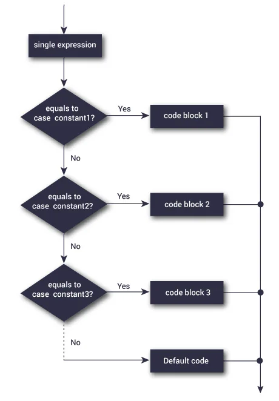

# C switch Statement
***
The switch statement allows us to execute one code block among many alternatives.

You can do the same thing with the `if...else..if` ladder. However, the syntax of the `switch` statement is much easier to read and write.

## Syntax of switch...case
***
```c
switch (expression)
{
    case constant1:
      // statements
      break;

    case constant2:
      // statements
      break;
    .
    .
    .
    default:
      // default statements
}
```

### How does the switch statement work?
***

The `expression` is evaluated once and compared with the values of each `case` label.

 - If there is a match, the corresponding statements after the matching label are executed. For example, if the value of the expression is equal to `constant2`, statements after `case constant2:` are executed until `break` is encountered.
 - If there is no match, the default statements are executed.
 - Notes:
    - If we do not use the `break` statement, all statements after the matching label are also executed.
    - The `default` clause inside the `switch` statement is optional.


### Switch Statement Flowchart
***


### Example: Simple Calculator
```c
// Program to create a simple calculator
#include <stdio.h>

int main() {
    char operation;
    double n1, n2;

    printf("Enter an operator (+, -, *, /): ");
    scanf("%c", &operation);
    printf("Enter two operands: ");
    scanf("%lf %lf",&n1, &n2);

    switch(operation)
    {
        case '+':
            printf("%.1lf + %.1lf = %.1lf",n1, n2, n1+n2);
            break;

        case '-':
            printf("%.1lf - %.1lf = %.1lf",n1, n2, n1-n2);
            break;

        case '*':
            printf("%.1lf * %.1lf = %.1lf",n1, n2, n1*n2);
            break;

        case '/':
            printf("%.1lf / %.1lf = %.1lf",n1, n2, n1/n2);
            break;

        // operator doesn't match any case constant +, -, *, /
        default:
            printf("Error! operator is not correct");
    }

    return 0;
}

```